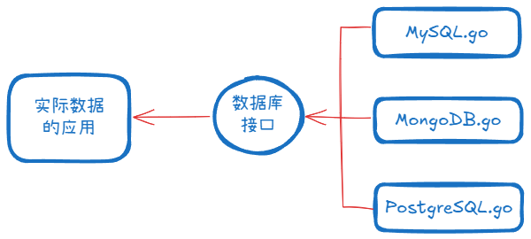

## 认识接口
接口只关心“能做什么”，而不是“什么类型”。举一个数据库的例子，实际应用需要对数据库中的数据进行操作，就借助数据库接口与数据库进行联通。这里的接口就只关注能进行什么操作，并不关心具体数据库类型以及对应具体怎么进行操作。

再通俗一点，甲方罗列了一篇要求，能做到所要求的就能当乙方，不管是谁也不管怎么做。而这一篇要求就是接口。
其实golang中的接口和java中的我觉得大差不差，都是一份契约，但有显式隐式的区别。golang中只要实现了接口定义的方法就认为实现了接口。
## 接口的必要性
接口能解耦，把“用的人”和“实现的人”分开。这让代码更灵活、更可扩展、更容易测试、更适合团队协作。所以 golang 倡导“面向接口编程”。
## 接口的使用
>"Design for interface, not for implementation."
>
 ——Victor Pierre

golang 中，最好的方式是运用的时候去考虑接口。也就是说，你关注需要的行为，而不是具体的实现。
### 接口的位置
我们说接口可以看做甲方对乙方提出的要求，甲方关心能做什么，乙方关心具体怎么做。那这份要求应该写到哪里呢？
java 强调的是“显式契约”，它把这份要求放到了公共层/定义层（调用方和实现方的桌子中间）。
golang 强调的是“隐式契约”，要求更靠近甲方（调用方）。
似乎各有各的道理，但我作为 go 的粉丝，我认为 golang 的接口更合理。
## git测试
==pc端==
==pad端==