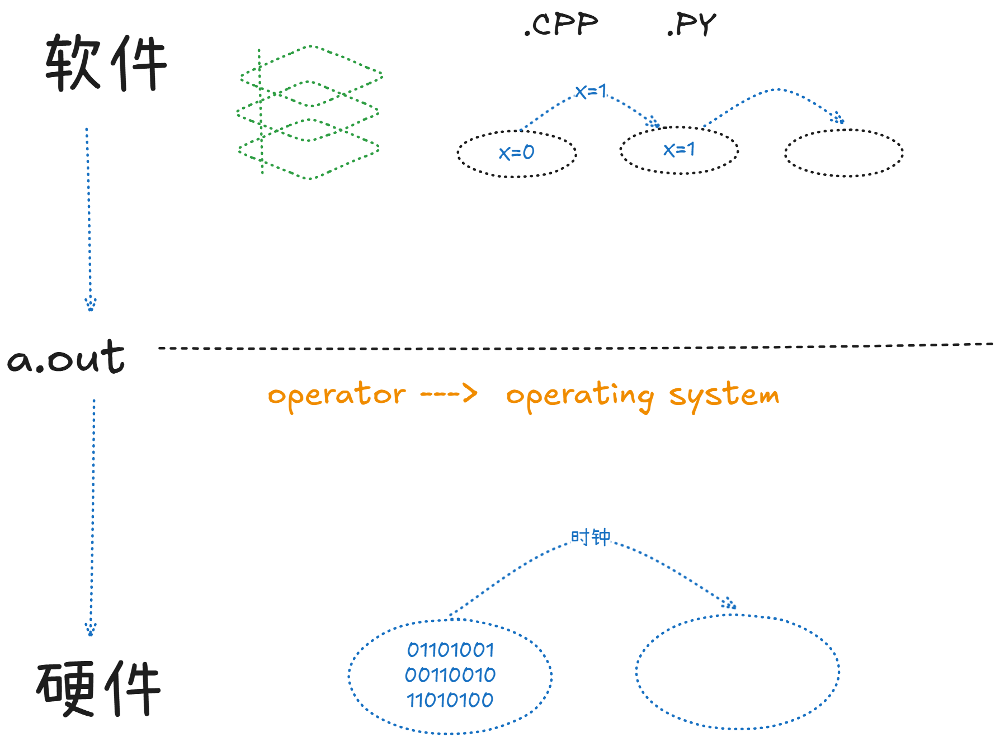

## 为什么要学操作系统
去寻找你的梦想！
（很打动我的老师）
## 什么是操作系统
Operating System: A body of ==software==, in fact, that is responsible for making it easy to run programs (even allowing you to seemingly run many at the same time), allowing programs to share memory, enabling programs to interact with divices, and other fun stuff like taht. (OSTEP)
*操作系统是管理计算机硬件和软件资源，并为用户和其他程序提供服务的*
其实怎么规范的定义不重要，get就好
从历史来看：==operator --> operating system==

不排队咯！
## 怎么学操作系统
试着去成为一个有梦想的CS人
Academic integrity  ==主动不参考别人完成的实验代码==
with AI 